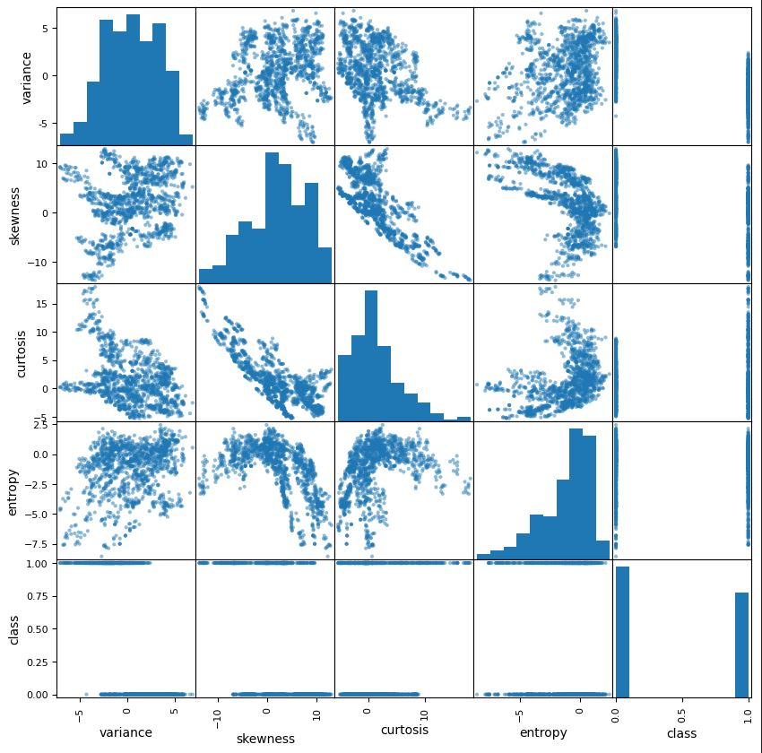

# Machine Learning Midterm Project: Banknote Authentication Analysis
**Author:** AARON 
**Date:** November, 8, 2025 
**Objective:** Setup two model types, Neural Network and Decision Tree and use these to predict authenticity of bank notes from the UCI Banknote Authentication Dataset.

## Introduction
- 1st, This project uses the UCI Banknote Authentication Dataset to Explore and Clean data, choose a features used to predict authenticity of bank notes, and split the dataset into train and test subsets.
- 2nd, Two model types, Neural Network and Decision Tree, will be used these to predict authenticity of bank notes from the UCI Banknote Authentication Dataset.

### Reflection 3:
- Why are these features selected?  Curtosis, Variance, and Skewness were selected based on reviewing the overview of the data in the scatter matrix.  I saw that when skewness and variance are high in value there is a tendency for genuine notes.  I also saw when there is a lower curtosis value the tendency it towards genuine notes.  So I want to focus on these.  
- I chose for case 3 a feature engineered variable where I add the values of skewness and variance to heighten the positive values weight of the parameters.  I think that will help the model out even more.

Decision Tree Data

| Model Type    | Case   | Features Used     | Accuracy | Precision | Recall | F1-Score  | Notes |
|---------------|--------|-------------------|----------|-----------|--------|-----------|-------|
| Decision Tree | Case 1 | Curtosis, Variance | 91.6%   | 91.7%     | 91.6%  | 91.6%     | -     |
|               | Case 2 | Skewness, Variance | 93.1%   | 93.2%     | 93.1%  | 93.1%     | -     |
|               | Case 3 | Curtosis, skew_var | 98.6%   | 98.6%     | 98.6%  | 98.5%     | -     |

### Reflection 4 (Decision Tree Models):
- How well did the different cases perform?  I was happy to see all of the parameters at or above 91%.
- Are there any surprising results?  I was surprised that all the training values were 100%.  I'm not sure why that is.
I was surprised to see that the engineered feature had such a big impact.
- Which inputs worked better? I think Skewness along with Variance is a key parameter since Case 2 outperformed.  I am excited to see how these cases will turn out in a Neural Network model.

### Reflection 5 (Neural Network Models):
- How well did each of these neural network cases perform?  The Neural network cases with Skewness outperformed the decision tree.  But Case 1 for the NN was significantly worse at predicting that all other instances in NN or Decision Tree
- Are there any surprising results or insights?  I am surprised Skewness seemed to have such a strong effect on the metrics.  The only difference between Case 1 and Case 3 was skewness and it had a 7% difference in the results.
- Why might one model outperform the others?  Looking at the Neural Network graphs it looks like a surface with points plotted over areas that the model predicts.  That makes sense to me that the NN can make good predictions over asking questions in the decision tree.

Neural Network and Decision Tree Data Metric

| Model Type    | Case   | Features Used     | Accuracy | Precision | Recall | F1-Score  | Notes |
|---------------|--------|-------------------|----------|-----------|--------|-----------|-------|
| Decision Tree | Case 1 | Curtosis, Variance | 91.6%   | 91.7%     | 91.6%  | 91.6%     | -     |
|               | Case 2 | Skewness, Variance | 93.1%   | 93.2%     | 93.1%  | 93.1%     | -     |
|               | Case 3 | Curtosis, skew_var | 98.6%   | 98.6%     | 98.6%  | 98.5%     | -     |
|---------------|--------|--------------------|---------|-----------|--------|-----------|-------|
| Neural Network| Case 1 | Curtosis, Variance | 86.2%   | 86.2%     | 86.2%  | 86.2%     | -     |
|               | Case 2 | Skewness, Variance | 94.6%   | 94.6%     | 94.6%  | 94.6%     | -     |
|               | Case 3 | Curtosis, skew_var | 99.6%   | 99.6%     | 99.6%  | 99.6%     | -     |

## Section 6. Final Thoughts & Insights

- The accuracy and other metrics were higher for this dataset compared to the Titanic dataset.  It was nice to see a higher percentage for these metrics.  
- I'm not sure why the Neural Network for Case 1 shows such a low percentage compared to other NN Cases, but also compared to Case 1 in the Decision tree.  It seems there must be an error, but I have checked a few times and cannot locate why this happened.
- At first I used the Case 3 engineered parameter as Skewness Times Variance.  It performed a little worse than CASE 2.  I thought I would try adding them instead, towards the end of the project, and the numbers returned tremendous.  There was only one misclassification in the CASE 3 Neural Network results.
- I got the idea to combine the Skewness and Variance from the Scatter Matrix.  I saw Genuine notes had higher values for both these parameters.  So I thought I could combine them into one variable and that worked out great.
- I have not tried three parameters in a neural network.  I liked the decisions surface for two inputs.  So I combined Skewness and Variance.

- I was happy with these results and glad inspection of the scatter plot let me to combine the correct features.